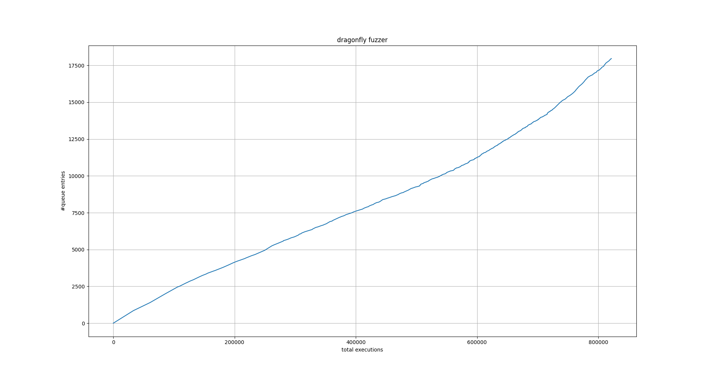
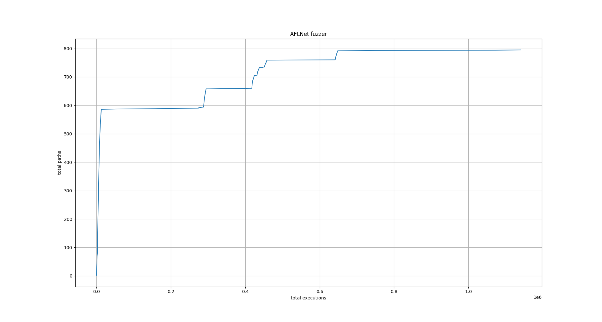

# Evaluation

To evaluate dragonfly's performance, it is measured how much coverage
it can achieve in comparison to AFLNet.
The program under test is [ProFTPD](http://proftpd.org/) and both fuzzers start with an empty corpus and a dictionary of supported
FTP commands.
The campaign is run for 24h and after that, the _statement_ coverage, obtained via gcov, is compared.

## Dragonfly Fuzzer
```
cd dragonfly
docker build --pull -t evaluation-dragonfly -f Dockerfile-fuzz .
mkdir output
docker run --security-opt seccomp:unconfined -v "$PWD/output":/output evaluation-dragonfly
```

The container must be stopped with `docker stop <container-id>`, Ctrl+C will not work.

To collect the coverage report execute:
```
cd dragonfly
docker build --pull -t coverage-dragonfly -f Dockerfile-cov .
docker run -v "$PWD/output":/output coverage-dragonfly
```

The report can be found in `output/report/index.html`.

## AFLNet Fuzzer
```
cd aflnet
docker build --pull -t evaluation-aflnet -f Dockerfile-fuzz .
mkdir output
echo core | sudo tee /proc/sys/kernel/core_pattern
pushd /sys/devices/system/cpu
echo performance | sudo tee cpu*/cpufreq/scaling_governor
popd
docker run --security-opt seccomp:unconfined -v "$PWD/output":/output evaluation-aflnet
```

The container must be stopped with `docker stop <container-id>`, Ctrl+C will not work.

To collect the coverage report execute:
```
cd aflnet
docker build --pull -t coverage-aflnet -f Dockerfile-cov .
docker run -v "$PWD/output":/output coverage-aflnet
```

The report can be found in `output/report/index.html`.

## Results
|                          | **AFLNet** | **dragonfly** |
|--------------------------|------------|---------------|
| **selection algorithms** | favor      | random        |
| **line coverage**        | 10.7%      | 30.7%         |
| **mean exec/s**          | 18.01      | 21.63         |
| **unique bugs**          | 0          | 2             |

Furthermore we can see that the time window of 24h was not enough for the dragonfly fuzzer, because
coverage did not plateau yet:


In contrast to AFLNet:

